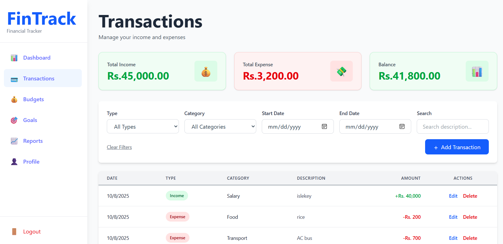

# FinTrack

A full-stack personal finance tracking application built with ASP.NET Core Web API and React.

## Project Structure

- `FinTrack.API/` - Backend ASP.NET Core Web API
- `fintrack-frontend/` - Frontend React application

## Prerequisites

- .NET 8 SDK
- Node.js 18+
- SQL Server (or LocalDB for development)

## Backend Setup

1. Navigate to `FinTrack.API/`
2. Restore packages: `dotnet restore`
3. Update database: `dotnet ef database update`
4. Run the API: `dotnet run`

The API will be available at `http://localhost:5000` with Swagger at `http://localhost:5000/swagger`.

## Frontend Setup

1. Navigate to `fintrack-frontend/`
2. Install dependencies: `npm install`
3. Start development server: `npm run dev`

The frontend will be available at `http://localhost:5173`.

## Features

- User authentication with JWT
- Transaction management
- Account tracking
- Budget planning
- Financial goals
- Reports and analytics

## Technologies

- Backend: ASP.NET Core, Entity Framework Core, SQL Server, JWT
- Frontend: React, Vite, Redux Toolkit, Tailwind CSS, Chart.js

## Screenshots

Below are a few screenshots from the app (stored in docs/images/):

Dashboard

Transactions

Budget Management

